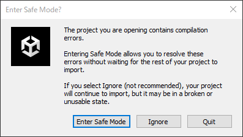
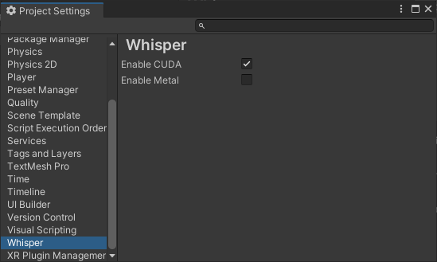
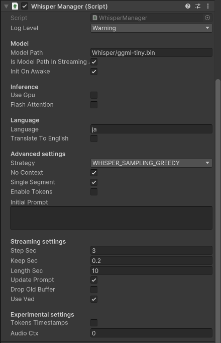
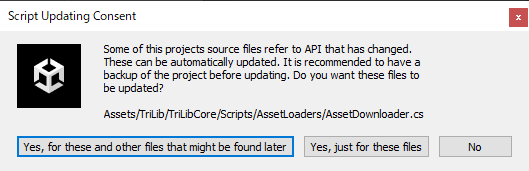
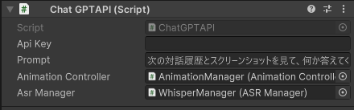
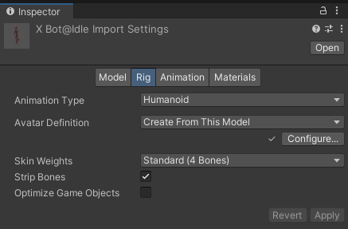
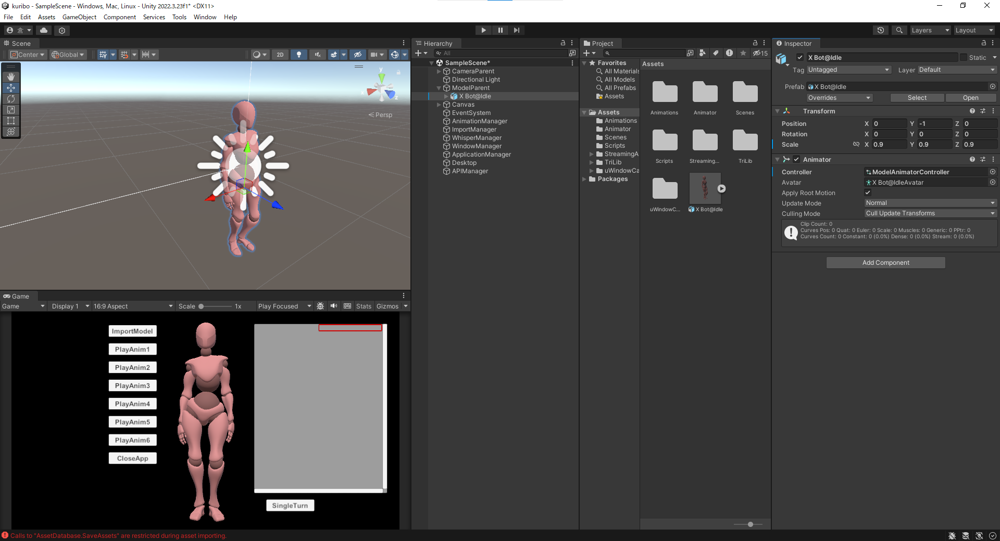
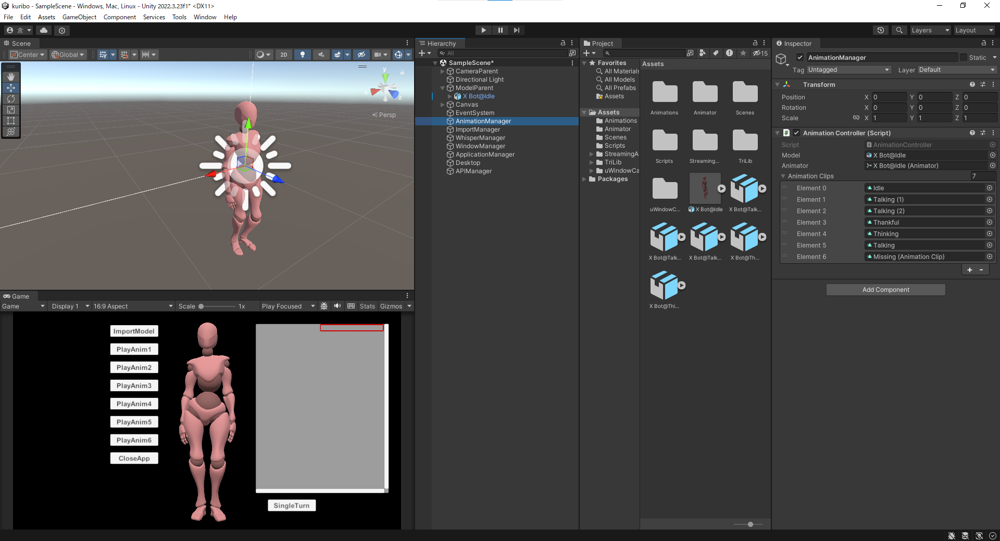

# くりぼっと（Kuribot）  
**くりぼっと（Kuribot）** は3Dモデルをデスクトップ上に表示し、デスクトップマスコットとして機能する対話型アプリケーションです。リアルタイムで認識した音声と、現在開いているウィンドウのスクリーンショットをChatGPTに送信します。その結果として得られる応答をチャット形式で表示し、マスコットがユーザーと対話しているかのような体験を提供します。

<br>

## 目次
- [セットアップ手順](#セットアップ手順)
  - [1. プロジェクトを開く](#1-プロジェクトを開く)
  - [2. 依存ライブラリの導入](#2-依存ライブラリの導入)
    - [2.1 Whisper.unity（音声認識）](#21-whisperunity音声認識)
    - [2.2 uWindowCapture（画面キャプチャ）](#22-uwindowcapture画面キャプチャ)
    - [2.3 TriLib（3Dモデル読み込み）](#23-trilib3dモデル読み込み)
  - [3. ChatGPT APIの設定](#3-chatgpt-apiの設定)
  - [4. 初期モデルとアニメーションの設定](#4-初期モデルとアニメーションの設定)
    - [4.1 初期モデルの配置](#41-初期モデルの配置)
    - [4.2 Animatorの設定](#42-animatorの設定)
    - [4.3 AnimationManagerの設定](#43-animationmanagerの設定)
  - [5. Windowsでのビルド](#5-windowsでのビルド)
- [操作方法](#操作方法)
  - [アプリの起動と基本動作](#アプリの起動と基本動作)
  - [ボタンの説明](#ボタンの説明)
  - [モデルやUIの操作](#モデルやuiの操作)
  - [注意事項](#注意事項)
- [動作環境](#動作環境)
- [開発者向け（拡張方法）](#開発者向け拡張方法)

<br>
<br>

# セットアップ手順

## 1. プロジェクトを開く
本リポジトリをクローンし、`D/kuribo`ディレクトリをUnityで開いてください。

※最初にプロジェクトを開く際、セーフモードで開くかどうかを尋ねられる場合がありますが、**[Ignore]** を選択してエディターを開いてください。これは一部の依存スクリプトが未設定のため一時的に発生します。



Unityエディターが開けたら、プロジェクトウィンドウ内の `Assets/Scenes` フォルダ内の **`SampleScene`** を開いてください。 


<br>

## 2. 依存ライブラリの導入

### 2.1 Whisper.unity（音声認識）  
1. Unityのメニューから **[Window] > [Package Manager]** を開きます。  
2. 左上の **[＋] ボタン > [Add package from git URL]** を選択し、以下のURLを入力して **[Add]** をクリックします。  
   ```
   https://github.com/Macoron/whisper.unity.git?path=/Packages/com.whisper.unity
   ```
3. インポート完了後、**[Edit] > [Project Settings] > [Whisper]** を開き、**[Enable CUDA]** にチェックを入れます。  
   ※環境によってはCUDA設定項目が表示されない場合（非対応GPUなど）がありますが、その場合は設定不要です。




4. 以下のサイトからWhisper用の重みモデル（例：`ggml-tiny.bin`）をダウンロードし、  
   `Assets/StreamingAssets/Whisper` フォルダに配置します。  
   [https://huggingface.co/ggerganov/whisper.cpp/blob/main/ggml-tiny.bin](https://huggingface.co/ggerganov/whisper.cpp/blob/main/ggml-tiny.bin)

5. `Packages/Whisper/Runtime/WhisperManager.cs` を開き、5行目の以下の一文を削除してください。
   ```csharp
   using UnityEngine.Serialization;
   ```

6. シーン上の「**WhisperManager**」オブジェクトにアタッチされている「**WhisperManager.cs**」コンポーネントの変数を以下のように設定してください：
   - **Model Path** → `Whisper/ggml-tiny.bin` (使用するWhisper用の重みモデル) 
   - **Language** → `ja`  
   - **StepSec** → `3`



<br>

### 2.2 uWindowCapture（画面キャプチャ）  
以下のリンクから「**uWindowCapture@v1.1.2.unitypackage**」をダウンロードし、プロジェクトにインポートしてください。  
[https://github.com/hecomi/uWindowCapture/releases](https://github.com/hecomi/uWindowCapture/releases)

<br>

### 2.3 TriLib（3Dモデル読み込み）  
1. 以下のリンクから「**TriLib 2 - Model Loading Package**」を購入・ダウンロードし、プロジェクトにインポートします。  
   [https://assetstore.unity.com/packages/tools/modeling/trilib-2-model-loading-package-157548](https://assetstore.unity.com/packages/tools/modeling/trilib-2-model-loading-package-157548)

※Unityのバージョンによっては、TriLibインポート後に以下のようなダイアログが表示される場合がありますが、そのまま **[Yes, for these and other files that might be found later]** を選択してください。




2. シーン上の「**ImportManager**」オブジェクトにアタッチされている「**ImportController**」コンポーネントの変数を以下のように設定します。  
   - **avatarMapper** → `Assets/TriLib/TriLibCore/Resources/Mappers/Avatar/MixamoAndBipedByNameHumanoidAvatarMapper.asset`  
   - **rootBoneMapper** → `Assets/TriLib/TriLibCore/Resources/Mappers/RootBone/ByNameRootBoneMapper.asset`

<br>

## 3. ChatGPT APIの設定  
シーン内の「**APIManager**」オブジェクトにアタッチされた「**ChatGPTAPI**」コンポーネントの **[ApiKey]** に、OpenAIのAPIキーを入力してください。
また、必要に応じて **[Prompt]** も自由に変更可能です。



<br>

## 4. 初期モデルとアニメーションの設定

### 4.1 初期モデルの配置  
任意の **FBXモデル** をプロジェクトにインポートしてください。  
モデルの **[Animation Type]** を **[Humanoid]** に設定し、シーン内の「**ModelParent**」オブジェクトの子として配置します。  

> Unityでモデルの **[Animation Type]** を変更するには、FBXファイルを選択し、Inspectorの **[Rig]** タブから設定します。

> モデルを配置後、モデルの位置（Transform）を適宜調整してください。




#### モデル例（無料で利用可能）  
- [ユニティちゃん公式サイト](https://unity-chan.com/)  
- [Mixamo（Adobe）](https://www.mixamo.com/)  

※各モデルの利用にあたっては、配布元のライセンス・利用規約をご確認の上、各自の責任でご使用ください。

<br>

### 4.2 Animatorの設定  
モデルに「**Animator**」コンポーネントを追加し、以下のように設定します。  
- **Controller** → `Assets/Animator/ModelAnimatorController.controller`  
- **Avatar** → インポートしたモデルのアバター


<br>

### 4.3 AnimationManagerの設定  
シーン内の「**AnimationManager**」オブジェクトにアタッチされた「**AnimationController**」コンポーネントの変数を設定します。  
- **Model** → 「ModelParent」の子として配置したモデルオブジェクト  
- **Animator** → 上記モデルオブジェクトのAnimatorコンポーネント  
- **AnimationClips** → 使用したいアニメーションファイルを複数設定  

> **Element 0** に設定するアニメーションは「待機状態」として扱われます。  
> ループ再生が推奨されるため、FBXファイルを選択してInspectorから **[Loop Time]** にチェックを入れてください。

> 設定するアニメーションは、モデルの位置（Transform）を極端に変えないものを使用してください。位置が移動するようなアニメーションを使うと意図しない挙動になります。

> 設定したアニメーションは、APIの応答時にランダムで再生されます。




<br>

## 5. Windowsでのビルド
1. エディタ上で実行し問題がなければ、メニューから **[File] > [Build Settings]** を開きます。
2. Platform は 「Windows, Mac, Linux」 が選択されていることを確認します。
3. Scenes In Build に 「SampleScene」 が含まれていることを確認します。
4. **[Build]** または **[Build And Run]** をクリックし、任意のフォルダにビルドしてください。
5. 出力された .exe ファイルを実行するとアプリが起動します。

<br>

# 操作方法

## アプリの起動と基本動作

1. ビルド済みのアプリ（.exeファイル）を起動します。  
   起動するとデスクトップ上に「くりぼっと」の3Dモデルと操作用UIボタンが表示されます。

2. 「**SingleTurn**」 ボタンを押すと、マイクから取得した発話内容と画面のスクリーンショットがChatGPTに送信されます。

3. ChatGPTの応答メッセージが表示されると同時に、  
   あらかじめ設定しておいたアニメーションがランダムに自動再生されます。

<br>

## ボタンの説明

- 「**ImportModel**」 ボタン：新しい3Dモデルをインポートして設定できます。
- 「**PlayAnim**」 ボタン：設定してあるアニメーションを手動で再生します。
- 「**CloseApp**」 ボタン：アプリを終了します。

<br>

## モデルやUIの操作

- **左クリック＋ドラッグ**：モデルとUIの位置を移動できます。  
- **右クリック＋ドラッグ**：モデルを回転させられます。  
- **左Ctrlキー＋マウススクロール**：モデルとUIボタンのサイズを変更できます。  
- **F1キー**：ボタンUIの表示／非表示を切り替えられます。

<br>

## 注意事項

- APIキーが正しく設定されていないと、対話ができません。  
- マイクや画面キャプチャの許可をOS側で求められる場合があります。
- 本ソフトウェアの利用に伴ういかなる損害についても、開発者および配布者は責任を負いません。

<br>
<br>

# 動作環境

- 対応OS：Windows10, Windows11
- Unityバージョン：2022.3.23f1
- CUDA必須（WhisperでGPU処理を有効にするため）

<br>
<br>

# 開発者向け（拡張方法）

各処理はそれぞれ以下のスクリプトに記述しています。必要に応じて拡張、修正してご利用ください。

- **モデルの読み込みや切り替え** ：`Assets/Scripts/ImportController.cs`
- **アニメーションの制御** ：`Assets/Scripts/AnimationController.cs`
- **音声入力と文字起こし** ：`Assets/Scripts/ASRManager.cs`
- **ウィンドウの移動・透過・サイズ変更** ：`Assets/Scripts/MovableTransparentWindow.cs`
- **ChatGPTとの通信やレスポンス制御** ：`Assets/Scripts/ChatGPTAPI.cs`
  